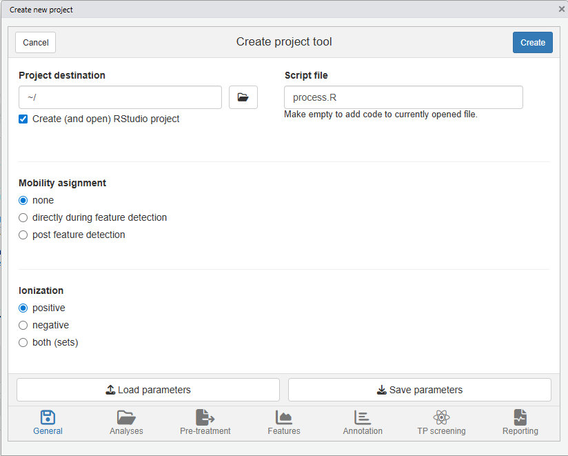
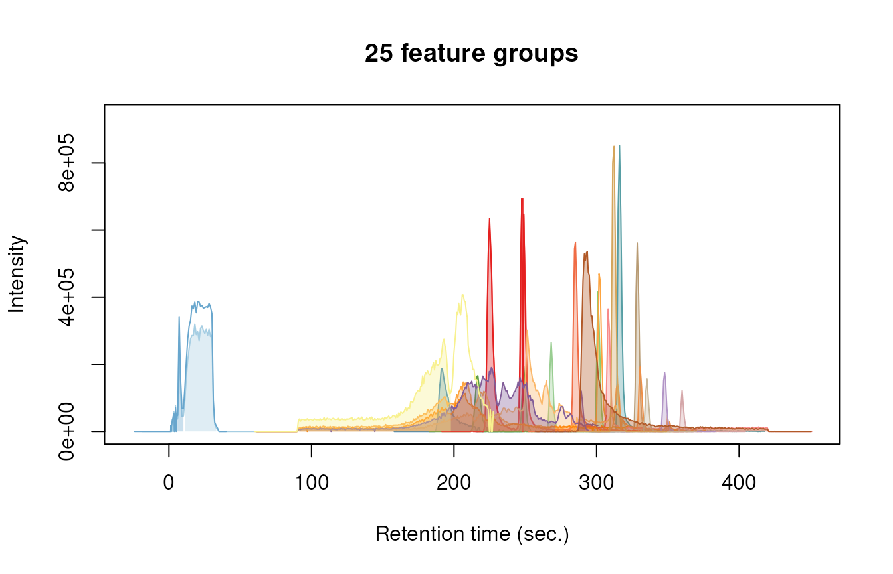
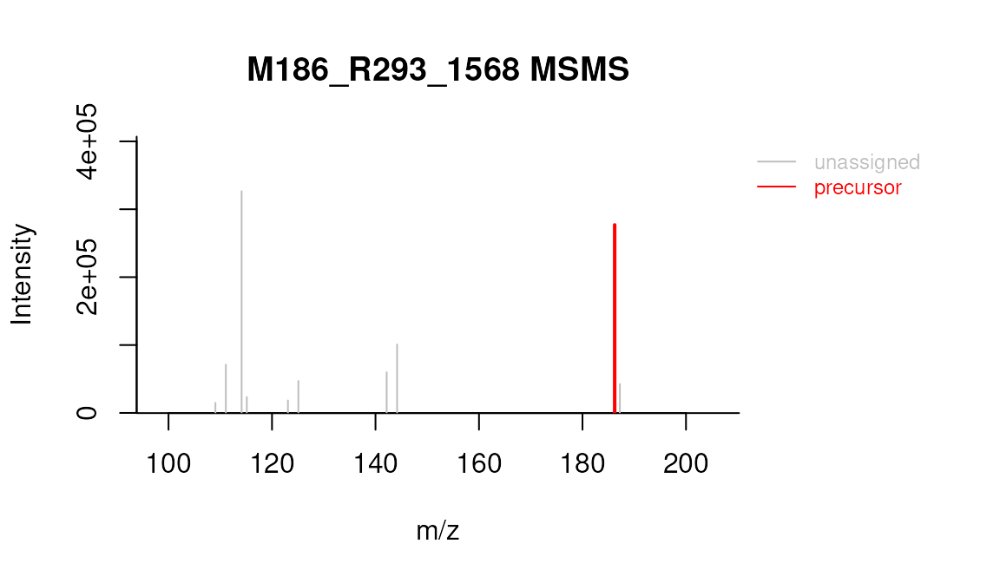
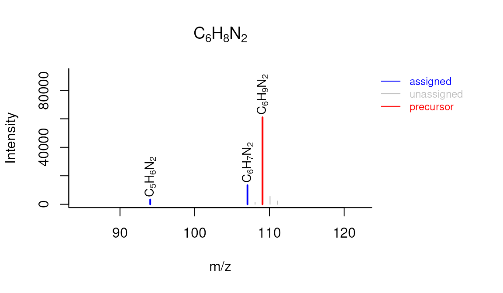
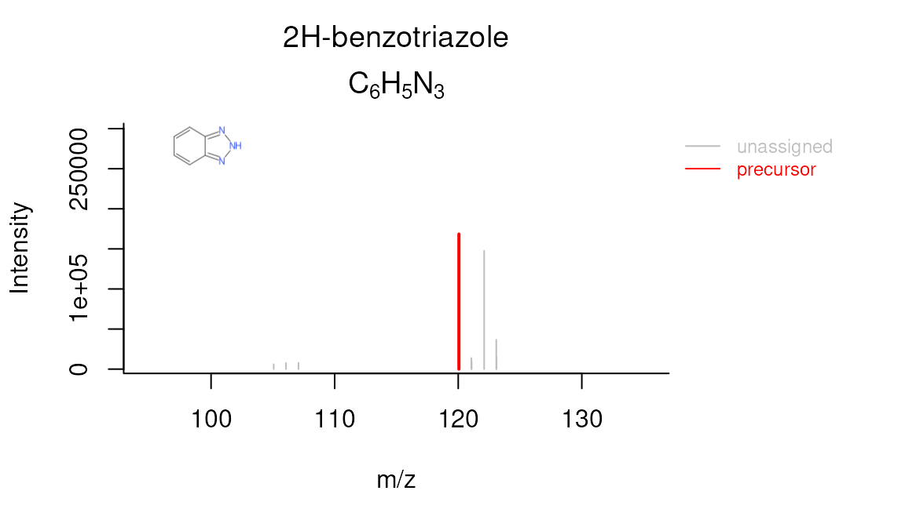

# patRoon tutorial

## Introduction

In this tutorial you will learn how to perform a simple non-target
analysis with `patRoon`. This tutorial is not meant to give a detailed
overview of `patRoon`. Instead, it serves as a quick introduction on how
to use `patRoon` to setup and perform a full non-target analysis
workflow.

The workflow in this tutorial consists of the following steps:

## Data

In this tutorial we will use example data provided within the
[patRoonData](https://github.com/rickhelmus/patRoonData) package. Please
make sure this package is installed (see the
[Handbook](https://rickhelmus.github.io/patRoon/handbook_bd/index.html)
for brief installation instructions). The example dataset contains LC-MS
data for a standard mixture with known composition (‘standard-X’) and a
blank solvent (‘solvent-X’), both in triplicate and measured with
positive and negative ionization. While this may not seem like the most
exciting data, it does allow to demonstrate the most important
functionality of `patRoon`.

The provided analyses already have been exported to an open format
(*.mzML*) and are ready to use. For your own data it may be necessary to
first export your data to *mzXML* or *mzML* and perform other data
pre-treatment steps such as mass re-calibration. This can be done using
the tools from [ProteoWizard](http://proteowizard.sourceforge.net/) or
software from your mass spectrometer vendor. Alternatively, `patRoon`
can do this automatically for your analyses with the
[`convertMSFiles()`](https://rickhelmus.github.io/patRoon/reference/MSConversion.md)
function. Please see the handbook and reference manual for its usage.

## New project

Whenever you start a new non-target analysis it is highly recommended to
start this from a fresh *project directory*. This directory will contain
your `R` processing script(s) and any other output generated during the
workflow. Note that this directory does not have to contain the raw MS
data files. In fact, keeping these files separate may be handy, for
instance, if you want to run multiple non-target analyses on these files
or store the analysis files on a shared location.

Starting a new project typically consists of

1.  Creating a new directory (unsurprisingly!)
2.  Changing the active working directory to the project directory
    (e.g. with [`setwd()`](https://rdrr.io/r/base/getwd.html)).
3.  Create (or copy) an `R` processing script.

Note that step 2 is important as any output files (e.g. reports and
cached results) are stored to the current working directory by default.
Consequently, always take care to ensure that this directory is active,
for instance, after restarting `R`.

Steps 1-3 can be easily performed with the
[`newProject()`](https://rickhelmus.github.io/patRoon/reference/newProject.md)
function. Alternatively, you can of course also perform these steps
yourself. Both approaches will be discussed in the next sections.

### Automatic project creation

Ensure that RStudio is active and start the new project utility:

``` r

patRoon::newProject()
```

> ***NOTE*** Currently
> [`newProject()`](https://rickhelmus.github.io/patRoon/reference/newProject.md)
> *only* works when using RStudio.

A dialog should pop-up (see screenshot below) where you can specify
where and how the new project will be generated, which analyses you want
to include and define a basic workflow. Based on this input a new
project with a template script will be automatically generated.



For this tutorial make the following selections

- **Destination tab** Select your desired location of the new project.
  Leave other settings as they are.
- **Analyses tab** Here you normally select your analyses. However, for
  this tutorial simply select the *Example data* option.
- **Data pre-treatment tab** Since the example data is already ready to
  use you can simply skip this tab.
- **Features tab** Leave the default OpenMS algorithm for feature
  finding and grouping.
- **Annotation tab** Select *GenForm* and *MetFrag* for the formula and
  compound annotation algorithms, respectively.
- **TP screening tab** No need to do anything here for this tutorial.
- **Reporting tab** Make sure to enable HTML reporting.

### Manual project creation

For RStudio users it is easiest to simply create a new RStudio project
(e.g. *File* –\> *New Project*). This will create a new directory and
ensure that the working directory is set whenever you re-open it.
Alternatively, you can do this manually, for instance:

``` r

projDir <- "~/myProjectDir"
dir.create(projDir)
setwd(projDir)
```

The next step is to create a new `R` script. For this tutorial simply
copy the script that is shown in the next section to a new `.R` file.

### Template R script

After you ran
[`newProject()`](https://rickhelmus.github.io/patRoon/reference/newProject.md)
the file below will be created. Before running this script, however, we
still have to add and modify some of its code. In the next sections you
will learn more about each part of the script, make the necessary
changes and run its code.

``` r

# Script automatically generated on Tue Feb 17 08:05:32 2026

library(patRoon)

# -------------------------
# initialization
# -------------------------

workPath <- "C:/myproject"
setwd(workPath)

# Example data from patRoonData package (triplicate solvent blank + triplicate standard)
anaInfo <- patRoonData::exampleAnalysisInfo("positive")

# -------------------------
# features
# -------------------------

# Find all features
# NOTE: see the reference manual for many more options
fList <- findFeatures(anaInfo, "openms", noiseThrInt = 1000, chromSNR = 3, chromFWHM = 5, minFWHM = 1, maxFWHM = 30)

# Group and align features between analyses
fGroups <- groupFeatures(fList, "openms", rtalign = TRUE)

# Basic rule based filtering
fGroups <- filter(fGroups, preAbsMinIntensity = 100, absMinIntensity = 10000, relMinReplicateAbundance = 1,
                  maxReplicateIntRSD = 0.75, blankThreshold = 5, removeBlanks = TRUE, retentionRange = NULL,
                  mzRange = NULL)

# Update group properties
fGroups <- updateGroups(fGroups, what = c("ret", "mz", "mobility"), intWeight = FALSE)

# -------------------------
# annotation
# -------------------------

# Retrieve MS peak lists
avgMSListParams <- getDefAvgPListParams(clusterMzWindow = 0.005)
mslists <- generateMSPeakLists(fGroups, avgFeatParams = avgMSListParams, avgFGroupParams = avgMSListParams)
# Rule based filtering of MS peak lists. You may want to tweak this. See the manual for more information.
mslists <- filter(mslists, MSLevel = 2, absMinIntensity = NULL, relMinIntensity = 0.05, topMostPeaks = 25,
                  maxMZOverPrec = 4)

# Calculate formula candidates
formulas <- generateFormulas(fGroups, mslists, "genform", adduct = "[M+H]+", elements = "CHNOP", oc = FALSE,
                             calculateFeatures = FALSE)
formulas <- estimateIDConfidence(formulas, IDFile = "idlevelrules.yml")

# Calculate compound structure candidates
compounds <- generateCompounds(fGroups, mslists, "metfrag", adduct = "[M+H]+", database = "pubchemlite",
                               maxCandidatesToStop = 2500)
compounds <- addFormulaScoring(compounds, formulas, updateScore = TRUE)

compounds <- estimateIDConfidence(compounds, MSPeakLists = mslists, formulas = formulas, IDFile = "idlevelrules.yml")

# -------------------------
# reporting
# -------------------------

# Advanced report settings can be edited in the report.yml file.
report(fGroups, MSPeakLists = mslists, formulas = formulas, compounds = compounds, components = NULL,
       settingsFile = "report.yml", openReport = TRUE)
```

## Workflow

Now that you have generated a new project with a template script it is
time to make some minor modifications and run it afterwards. In the next
sections each major part of the script (initialization, finding and
grouping features, annotation and reporting) will be discussed
separately. Each section will briefly discuss the code, what needs to be
modified and finally you will run the code. In addition, several
functions will be demonstrated that you can use to inspect generated
data.

### Initialization

The first part of the script loads `patRoon`, makes sure the current
working directory is set correctly and loads information about the
analyses. This part in your script looks more or less like this:

``` r

library(patRoon)

workPath <- "C:/my_project"
setwd(workPath)

# Example data from patRoonData package (triplicate solvent blank + triplicate standard)
anaInfo <- patRoonData::exampleAnalysisInfo("positive")
```

After you ran this part the analysis information should be stored in the
`anaInfo` variable. This information is important as it will be required
for subsequent steps in the workflow. Lets peek at its contents:

``` r

anaInfo
```

    #>         analysis                                         path_centroid path_raw path_profile path_ims    replicate       blank
    #> 1  solvent-pos-1 /usr/local/lib/R/site-library/patRoonData/extdata/pos                                 solvent-pos solvent-pos
    #> 2  solvent-pos-2 /usr/local/lib/R/site-library/patRoonData/extdata/pos                                 solvent-pos solvent-pos
    #> 3  solvent-pos-3 /usr/local/lib/R/site-library/patRoonData/extdata/pos                                 solvent-pos solvent-pos
    #> 4 standard-pos-1 /usr/local/lib/R/site-library/patRoonData/extdata/pos                                standard-pos solvent-pos
    #> 5 standard-pos-2 /usr/local/lib/R/site-library/patRoonData/extdata/pos                                standard-pos solvent-pos
    #> 6 standard-pos-3 /usr/local/lib/R/site-library/patRoonData/extdata/pos                                standard-pos solvent-pos

As you can see the generated `data.frame` consists of the following
columns:

- *path\_\**: columns that specify the directory paths to the analysis
  files, in raw, centroided, profile and ims format. The `path_centroid`
  column is only used in most workflows.
- *analysis*: the name of the analysis. This should be the file name
  *without* file extension.
- *replicate*: to which *replicate* the analysis belongs. All analysis
  which are replicates of each other get the same name.
- *blank*: which replicate should be used for blank subtraction.

The latter two columns are especially important for [data
cleanup](#data-cleanup), which will be discussed later. For now keep in
mind that the analyses for the solvents and standards each belong to a
different replicate (`"solvent"` and `"standard"`) and that the solvents
should be used for blank subtraction.

In this tutorial the analysis information was just copied directly from
[patRoonData](https://github.com/rickhelmus/patRoonData). The
[`generateAnalysisInfo()`](https://rickhelmus.github.io/patRoon/reference/analysis-information.md)
function can be used to generate such a table for your own sample
analyses. This function scans a given directory for MS data files and
automatically fills in the `path` and `analysis` columns from this
information. In addition, you can pass replicate and blank information
to this function. Example:

``` r

generateAnalysisInfo(fromCentroid = patRoonData::exampleDataPath(), replicate = c(rep("solvent-pos", 3), rep("standard-pos", 3)),
                     blank = "solvent")
```

    #>         analysis                                         path_centroid path_raw path_profile path_ims    replicate   blank
    #> 1  solvent-pos-1 /usr/local/lib/R/site-library/patRoonData/extdata/pos                                 solvent-pos solvent
    #> 2  solvent-pos-2 /usr/local/lib/R/site-library/patRoonData/extdata/pos                                 solvent-pos solvent
    #> 3  solvent-pos-3 /usr/local/lib/R/site-library/patRoonData/extdata/pos                                 solvent-pos solvent
    #> 4 standard-pos-1 /usr/local/lib/R/site-library/patRoonData/extdata/pos                                standard-pos solvent
    #> 5 standard-pos-2 /usr/local/lib/R/site-library/patRoonData/extdata/pos                                standard-pos solvent
    #> 6 standard-pos-3 /usr/local/lib/R/site-library/patRoonData/extdata/pos                                standard-pos solvent

> ***NOTE*** Of course nothing stops you from creating a `data.frame`
> with analysis information manually within `R` or load the information
> from a *csv* file. In fact, when you create a new project with
> [`newProject()`](https://rickhelmus.github.io/patRoon/reference/newProject.md)
> you can select to generate a separate *csv* file with analysis
> information (i.e. by filling in the right information in the analysis
> tab).

> ***NOTE*** The blanks for the solvent analyses are set to themselves.
> This will remove any features from the solvents later in the workflow,
> which is generally fine as we are usually not interested in the blanks
> anyway.

## Find and group features

The first step of a LC-MS non-target analysis workflow is typically the
extraction of so called ‘features’. While sometimes slightly different
definitions are used, a feature can be seen as a single peak within an
extracted ion chromatogram. For a complex sample it is not uncommon that
hundreds to thousands of features can extracted. Because these large
numbers this process is typically automatized nowadays.

To obtain all the features within your dataset the `findFeatures`
function is used. This function requires data on the analysis
information (`anaInfo` variable created earlier) and the desired
algorithm that should be used. On top of that there are many more
options that can significantly influence the feature finding process,
hence, it is important to evaluate results afterwards.

In this tutorial we will use the [OpenMS](http://openms.de/) software to
find features and stick with default parameters:

``` r

fList <- findFeatures(anaInfo, "openms", noiseThrInt = 1000, chromSNR = 3, chromFWHM = 5, minFWHM = 1, maxFWHM = 30)
```

    #> Finding features with OpenMS for 6 analyses ...
    #> ================================================================================
    #> Loading peak intensities...
    #> Using 'mzr' backend for reading MS data.
    #> ================================================================================
    #> Done!
    #> Feature statistics:
    #> solvent-pos-1: 3760 (15.4%)
    #> solvent-pos-2: 3719 (15.3%)
    #> solvent-pos-3: 3820 (15.7%)
    #> standard-pos-1: 4373 (17.9%)
    #> standard-pos-2: 4486 (18.4%)
    #> standard-pos-3: 4222 (17.3%)
    #> Total: 24380

After some processing time (especially for larger datasets), the next
step is to *group features*. During this step, features from different
analysis are grouped, optionally after alignment of their retention
times. This grouping is necessary because it is common that instrumental
errors will result in (slight) variations in both retention time and
*m/z* values which may complicate comparison of features between
analyses. The resulting groups are referred to as **feature groups** and
are crucial input for subsequent workflow steps.

To group features the
[`groupFeatures()`](https://rickhelmus.github.io/patRoon/reference/groupFeatures.md)
function is used:

``` r

fGroups <- groupFeatures(fList, "openms", rtalign = TRUE)
```

    #> Grouping features with OpenMS...
    #> ===========
    #> Importing consensus XML...Done!
    #> 
    #> ===========
    #> Done!

The
[Handbook](https://rickhelmus.github.io/patRoon/handbook_bd/index.html)
and reference manual
([`?findFeatures`](https://rickhelmus.github.io/patRoon/reference/findFeatures.md)
and
[`?groupFeatures`](https://rickhelmus.github.io/patRoon/reference/groupFeatures.md))
lists many more algorithms and parameters that can be used for both
feature finding and grouping.

### Data clean-up

The next step is to perform some basic rule based filtering with the
filter() function. As its name suggests this function has several ways
to filter data. It is a so called generic function and methods exists
for various data types, such as the feature groups object that was made
in the previous section (stored in the the `fGroups` variable). Note
that in this tutorial the `absMinIntensity` was increased to `1E5` to
simplify the results.

``` r

fGroups <- filter(fGroups, preAbsMinIntensity = 100, absMinIntensity = 1E5,
                  relMinReplicateAbundance = 1, maxReplicateIntRSD = 0.75,
                  blankThreshold = 5, removeBlanks = TRUE,
                  retentionRange = NULL, mzRange = NULL)
```

    #> Applying intensity filter... Done! Filtered 0 (0.00%) features and 0 (0.00%) feature groups. Remaining: 24380 features in 7302 groups.
    #> Applying replicate abundance filter... Done! Filtered 8006 (32.84%) features and 3849 (52.71%) feature groups. Remaining: 16374 features in 3453 groups.
    #> Applying blank filter... Done! Filtered 13558 (82.80%) features and 2514 (72.81%) feature groups. Remaining: 2816 features in 939 groups.
    #> Applying intensity filter... Done! Filtered 2429 (86.26%) features and 806 (85.84%) feature groups. Remaining: 387 features in 133 groups.
    #> Applying replicate abundance filter... Done! Filtered 15 (3.88%) features and 9 (6.77%) feature groups. Remaining: 372 features in 124 groups.
    #> Applying replicate filter... Done! Filtered 0 (0.00%) features and 0 (0.00%) feature groups. Remaining: 372 features in 124 groups.

The following filtering steps will be performed:

- Features are removed if their intensity is below a defined intensity
  threshold (set by `absMinIntensity`). This filter is an effective way
  to not only remove ‘noisy’ data, but, for instance, can also be used
  to remove any low intensity features which likely miss MS/MS data.
- If a feature is not ubiquitously present in (part of) replicate
  analyses it will be filtered out from that replicate. This is
  controlled by setting `relMinReplicateAbundance`. The value is
  relative, for instance, a value of `0.5` would mean that a feature
  needs to be present in half of the replicates. In this tutorial we use
  a value of `1` which means that a feature should be present in all
  replicate samples. This is a *very* effective filter in removing any
  false positives, for instance, caused by features which don’t actually
  represent a well defined chromatographic peak.
- Similarly, the features within a replicate are removed if the relative
  standard deviation (RSD) of their intensities exceeds that of the
  value set by the `maxReplicateIntRSD` argument.
- Features are filtered out that do not have a significantly higher
  intensity than the blank intensity. This is controlled by
  `blankThreshold`: the given value of `5` means that the intensity of a
  feature needs to be at least five times higher compared to the
  (average) blank signal.

The `removeBlanks` argument tells will remove all blank analyses after
filtering. The `retentionRange` and `mzRange` arguments are not used
here, but could be used to filter out any features outside a give
retention or *m/z* range. There are many more filters: see `?filter()`
for more information.

As you may have noticed quite a large part of the features are removed
as a result of the filtering step. However, using the right settings is
a very effective way to separate interesting data from the rest.

The next logical step in a non-target workflow is often to perform
further prioritization of data. However, this will not be necessary in
this tutorial as our samples are just known standard mixtures.

After cleaning up the data, the
[`updateGroups()`](https://rickhelmus.github.io/patRoon/reference/featureGroups-class.md)
function is called to update the feature group properties (retention
time and m/z). This can improve their accuracy, since e.g. false
positives don’t attribute to the group properties anymore.

``` r

fGroups <- updateGroups(fGroups, what = c("ret", "mz", "mobility"), intWeight = FALSE)
```

To simplify processing, we only continue with the first 25 feature
groups:

``` r

fGroups <- fGroups[, 1:25]
```

### Inspecting results

In order to have a quick peek at the results we can use the default
printing method:

``` r

fGroups
```

    #> A featureGroupsOpenMS object
    #> Hierarchy:
    #> featureGroups
    #>     |-- featureGroupsOpenMS
    #> ---
    #> Object size (indication): 56.6 kB
    #> Algorithm: openms
    #> Feature groups: M100_R28_65, M102_R7_94, M109_R192_157, M116_R316_229, M120_R268_288, M134_R301_482, ... (25 total)
    #> Features: 75 (3.0 per group)
    #> Has IMS data: no
    #> Has normalized intensities: FALSE
    #> Internal standards used for normalization: no
    #> Predicted concentrations: none
    #> Predicted toxicities: none
    #> Analyses: standard-pos-1, standard-pos-2, standard-pos-3 (3 total)
    #> Replicates: standard-pos (1 total)
    #> Replicates used as blank: solvent-pos (1 total)

Furthermore, the
[`as.data.table()`](https://rickhelmus.github.io/patRoon/reference/generics.md)
function can be used to have a look at generated feature groups and
their intensities (*i.e.* peak heights) across all analyses:

``` r

as.data.table(fGroups)
```

    #>              group       ret       mz standard-pos-1_intensity standard-pos-2_intensity standard-pos-3_intensity
    #>             <char>     <num>    <num>                    <num>                    <num>                    <num>
    #>  1:    M100_R28_65  27.77433 100.1120                   304644                   275468                   283104
    #>  2:     M102_R7_94   7.12500 102.1277                   342224                   320876                   327020
    #>  3:  M109_R192_157 191.79933 109.0759                   186612                   187080                   176756
    #>  4:  M116_R316_229 316.04800 116.0527                   742572                   772332                   851204
    #>  5:  M120_R268_288 268.36133 120.0554                   264836                   245372                   216560
    #> ---                                                                                                             
    #> 21: M171_R226_1209 226.30333 171.0648                   190596                   171880                   155088
    #> 22: M180_R336_1410 335.51633 180.0804                   143896                   156384                   135340
    #> 23: M183_R193_1487 192.96133 183.0627                   274544                   250108                   234716
    #> 24: M183_R313_1489 312.67033 183.0779                   682396                   849328                   665428
    #> 25: M186_R293_1568 292.47467 186.2213                   487912                   488284                   509880

An overview of group properties is returned by the
[`groupInfo()`](https://rickhelmus.github.io/patRoon/reference/featureGroups-class.md)
method:

``` r

head(groupInfo(fGroups))
```

    #>            group       ret       mz
    #>           <char>     <num>    <num>
    #> 1:   M100_R28_65  27.77433 100.1120
    #> 2:    M102_R7_94   7.12500 102.1277
    #> 3: M109_R192_157 191.79933 109.0759
    #> 4: M116_R316_229 316.04800 116.0527
    #> 5: M120_R268_288 268.36133 120.0554
    #> 6: M134_R301_482 301.28933 134.0710

Finally, we can have a quick look at our data by plotting some nice
extracted ion chromatograms (EICs) for all feature groups:

``` r

plotChroms(fGroups, groupBy = "fGroups", showFGroupRect = FALSE, showPeakArea = TRUE,
           EICParams = getDefEICParams(topMost = 1), showLegend = FALSE)
```

    #> Using 'mzr' backend for reading MS data.
    #> ================================================================================



Note that we only plot the most intense feature of a feature group here
(as set by `topMost=1`). See the reference docs for many more parameters
to these functions
(e.g. [`?plotChroms`](https://rickhelmus.github.io/patRoon/reference/generics.md)).

## Annotation

### MS peak lists

After obtaining a good dataset with features of interest we can start
moving to find their chemical identity. Before doing so, however, the
first step is to extract all relevant MS data that will be used for
annotation. The tutorial data was obtained with data-dependent MS/MS, so
in the ideal case we can obtain both MS and MS/MS data for each feature
group.

The
[`generateMSPeakLists()`](https://rickhelmus.github.io/patRoon/reference/generateMSPeakLists.md)
function will perform this action for us and will generate so called *MS
peak lists* in the process. These lists are basically (averaged) spectra
in a tabular form.

``` r

avgPListParams <- getDefAvgPListParams(clusterMzWindow = 0.002)
mslists <- generateMSPeakLists(fGroups, avgFeatParams = avgPListParams, avgFGroupParams = avgPListParams)
```

    #> Loading all MS peak lists for 25 feature groups and 3 analyses...
    #> Using 'mzr' backend for reading MS data.
    #> ================================================================================
    #> Generating averaged peak lists for all feature groups... Done!

Note that we lowered the `clusterMzWindow` value to *0.002*. This window
is used during averaging to cluster similar *m/z* values together. In
general the better the resolution of your MS instrument, the lower the
value can be set.

Similar to feature groups the
[`filter()`](https://rickhelmus.github.io/patRoon/reference/generics.md)
generic function can be used to clean up the peak lists afterwards:

``` r

mslists <- filter(mslists, MSLevel = 2, absMinIntensity = NULL, relMinIntensity = 0.02, topMostPeaks = 10,
                  maxMZOverPrec = 4)
```

    #> Done! Filtered 1332 (15.42%) MS peaks. Remaining: 7307

This step removes all MS/MS peaks that are

1.  below 2% of the most intense peak in the spectrum (as set by
    `relMinIntensity`).
2.  more than 4 *m/z* units above the precursor *m/z* (as set by
    `maxMZOverPrec`).
3.  From the remaining peaks, no more than the ten most intense peaks
    are retained (as set by `topMostPeaks`).

### Formula annotation

Using the data from the MS peak lists generated during the previous step
we can generate a list of formula candidates for each feature group
which is based on measured *m/z* values, isotopic patterns and presence
of MS/MS fragments. In this tutorial we will use this data as an extra
hint to score candidate chemical structures generated during the next
step. The code below will use
[GenForm](https://sourceforge.net/projects/genform/) to perform this
step. Again running this code may take some time.

``` r

formulas <- generateFormulas(fGroups, mslists, "genform", adduct = "[M+H]+", elements = "CHNOPSCl",
                             oc = FALSE, calculateFeatures = FALSE)
```

    #> Loading all formulas...
    #> Converting to algorithm specific adducts... Done!
    #> ================================================================================
    #> Loaded 36 formulas for 23 feature groups (92.00%).
    #> Calculating annotation similarities... Done!

``` r

formulas <- estimateIDConfidence(formulas, IDFile = "idlevelrules.yml")
```

    #> Estimating identification levels for 23 feature groups with a total of 36 candidates...

    #> ================================================================================

Note that you may need to change the elements parameter to this
function, e.g. here to make sure that formulae with sulfur and chloride
(S/Cl) are also calculated. It is highly recommended to limit the
elements (by default it is just C, H, N, O and P) as this can
significantly reduce processing time and improbable formula candidates.
In this tutorial we already knew which compounds to expect so the choice
was easy, but often a good guess can be made in advance. The call the
[`estimateIDConfidence()`](https://rickhelmus.github.io/patRoon/reference/id-conf.md)
function is then used to estimate the confidence of the generated
formula candidates based on a set of rules defined in the
`idlevelrules.yml` file. This file is based on the [Schymanski ID
confidence
levels](https://rickhelmus.github.io/patRoon/articles/doi.org/10.1021/es5002105)
and can be modified to fit your needs.

### Compound annotation

Now it is time to actually see what compounds we may be dealing with. In
this tutorial we will use [MetFrag](http://ipb-halle.github.io/MetFrag/)
to come up with a list of possible candidate structures for each feature
group. Before we can start you have to make sure that MetFrag and the
PubChemLite library can be found by `patRoon`. Please see the
[Handbook](https://rickhelmus.github.io/patRoon/handbook_bd/index.html)
for installation instructions.

Then
[`generateCompounds()`](https://rickhelmus.github.io/patRoon/reference/generateCompounds.md)
is used to execute MetFrag and generate the `compounds`.

``` r

compounds <- generateCompounds(fGroups, mslists, "metfrag", adduct = "[M+H]+", database = "pubchemlite",
                               maxCandidatesToStop = 2500)
```

    #> Identifying 25 feature groups with MetFrag...
    #> Converting to algorithm specific adducts... Done!
    #> ================================================================================
    #> Loaded 936 compounds from 19 features (76.00%).
    #> Calculating annotation similarities... Done!

See `?generateCompounds()` for more information on possible databases
and many other parameters that can be set.

> ***NOTE*** This is often one of the most time consuming steps during
> the workflow. For this reason you should always take care to
> prioritize your data before running this function!

Finally we use the
[`addFormulaScoring()`](https://rickhelmus.github.io/patRoon/reference/compounds-class.md)
function to improve ranking of candidates by incorporating the formula
calculation data from the previous step, and use
[`estimateIDConfidence()`](https://rickhelmus.github.io/patRoon/reference/id-conf.md)
again to estimate identification confidence levels for each of the
candidates.

``` r

compounds <- addFormulaScoring(compounds, formulas, updateScore = TRUE)
```

    #> Adding formula scoring...
    #> ================================================================================

``` r

compounds <- estimateIDConfidence(compounds, MSPeakLists = mslists, formulas = formulas, IDFile = "idlevelrules.yml")
```

    #> Estimating identification levels for 19 feature groups with a total of 936 candidates...
    #> ================================================================================

### Inspecting results

Similar as feature groups we can quickly peek at some results:

``` r

mslists
```

    #> A MSPeakLists object
    #> Hierarchy:
    #> workflowStep
    #>     |-- MSPeakLists
    #>       |-- MSPeakListsSet
    #>       |-- MSPeakListsUnset
    #> ---
    #> Object size (indication): 844.6 kB
    #> Algorithm: patroon
    #> Total peak count: 7307 (MS: 6860 - MS/MS: 447)
    #> Average peak count/analysis: 2436 (MS: 2287 - MS/MS: 149)
    #> Total peak lists: 128 (MS: 75 - MS/MS: 53)
    #> Average peak lists/analysis: 43 (MS: 25 - MS/MS: 18)

``` r

formulas
```

    #> A formulas object
    #> Hierarchy:
    #> featureAnnotations
    #>     |-- formulas
    #>       |-- formulasConsensus
    #>       |-- formulasSet
    #>         |-- formulasConsensusSet
    #>       |-- formulasUnset
    #>       |-- formulasSIRIUS
    #> ---
    #> Object size (indication): 216.4 kB
    #> Algorithm: genform
    #> Formulas assigned to features:
    #>   - Total formula count: 0
    #>   - Average formulas per analysis: 0.0
    #>   - Average formulas per feature: 0.0
    #> Formulas assigned to feature groups:
    #>   - Total formula count: 36
    #>   - Average formulas per feature group: 1.6

``` r

compounds
```

    #> A compoundsMF object
    #> Hierarchy:
    #> compounds
    #>     |-- compoundsMF
    #> ---
    #> Object size (indication): 3.7 MB
    #> Algorithm: metfrag
    #> Number of feature groups with compounds in this object: 19
    #> Number of compounds: 936 (total), 49.3 (mean), 1 - 100 (min - max)

``` r

as.data.table(mslists)
```

    #>                group   type    ID        mz intensity fgroup_abundance_rel fgroup_abundance_abs feat_abundance_rel feat_abundance_abs precursor
    #>               <char> <char> <int>     <num>     <num>                <num>                <num>              <num>              <num>    <lgcl>
    #>    1:    M100_R28_65     MS     1  97.06464  32521.98                    1                    3          0.8952991          11.333333     FALSE
    #>    2:    M100_R28_65     MS     2  98.97523 148481.36                    1                    3          1.0000000          12.666667     FALSE
    #>    3:    M100_R28_65     MS     3 100.11201 210341.30                    1                    3          1.0000000          12.666667      TRUE
    #>    4:    M100_R28_65     MS     4 101.05956  28012.87                    1                    3          0.9743590          12.333333     FALSE
    #>    5:    M100_R28_65     MS     5 102.12772 274810.00                    1                    3          1.0000000          12.666667     FALSE
    #>   ---                                                                                                                                          
    #> 1511: M186_R293_1568   MSMS    29 125.09600  47036.71                    1                    3          1.0000000           4.666667     FALSE
    #> 1512: M186_R293_1568   MSMS    37 142.15886  59948.36                    1                    3          1.0000000           4.666667     FALSE
    #> 1513: M186_R293_1568   MSMS    39 144.17458 100887.25                    1                    3          1.0000000           4.666667     FALSE
    #> 1514: M186_R293_1568   MSMS    47 186.22173 277026.44                    1                    3          1.0000000           4.666667      TRUE
    #> 1515: M186_R293_1568   MSMS    48 187.22490  42499.82                    1                    3          1.0000000           4.666667     FALSE

``` r

as.data.table(formulas)[, 1:7] # only show first columns for clarity
```

    #>              group neutral_formula ion_formula neutralMass ion_formula_mz error   dbe
    #>             <char>          <char>      <char>       <num>          <num> <num> <num>
    #>  1:    M100_R28_65          C6H13N      C6H14N     99.1048       100.1121   0.7     1
    #>  2:     M102_R7_94          C6H15N      C6H16N    101.1204       102.1277   0.2     0
    #>  3:  M109_R192_157          C6H8N2      C6H9N2    108.0687       109.0760   0.3     4
    #>  4:  M116_R316_229          C5H9NS     C5H10NS    115.0456       116.0529   1.0     2
    #>  5:  M120_R268_288          C6H5N3      C6H6N3    119.0483       120.0556   1.6     6
    #> ---                                                                                  
    #> 32: M183_R193_1487        C5H6N6O2    C5H7N6O2    182.0552       183.0625  -1.7     6
    #> 33: M183_R313_1489       C7H15ClO3   C7H16ClO3    182.0710       183.0782   2.1     0
    #> 34: M183_R313_1489        C6H15O4P    C6H16O4P    182.0708       183.0781   1.1     0
    #> 35: M183_R313_1489        CH10N8OS    CH11N8OS    182.0698       183.0771  -4.2     1
    #> 36: M186_R293_1568         C12H27N     C12H28N    185.2143       186.2216   1.3     0

``` r

as.data.table(compounds)[, 1:5] # only show first columns for clarity
```

    #>               group explainedPeaks    score neutralMass                SMILES
    #>              <char>          <int>    <num>       <num>                <char>
    #>   1:  M109_R192_157              1 4.166634    108.0687       C1=CC=C(C=C1)NN
    #>   2:  M109_R192_157              1 3.913405    108.0687       C1=CC(=CC=C1N)N
    #>   3:  M109_R192_157              1 3.857652    108.0687     C1=CC=C(C(=C1)N)N
    #>   4:  M109_R192_157              1 3.533509    108.0687     C1=CC(=CC(=C1)N)N
    #>   5:  M109_R192_157              1 2.895269    108.0687       CC1=CN=C(C=N1)C
    #>  ---                                                                         
    #> 932: M186_R293_1568              3 2.168060    185.2143       CCCCCCC(CCCC)CN
    #> 933: M186_R293_1568              3 2.052083    185.2143   CCCC(CCC)(CC(C)C)NC
    #> 934: M186_R293_1568              3 2.052069    185.2143     CCCC(CCC)(CCC)NCC
    #> 935: M186_R293_1568              3 2.043274    185.2143 CC(C)CC(C)NC(C)CC(C)C
    #> 936: M186_R293_1568              3 2.042262    185.2143   CCCC(CCC)(CCC)N(C)C

``` r

plotSpectrum(mslists, "M186_R293_1568", MSLevel = 2)
```



``` r

plotSpectrum(formulas, 1, "M109_R192_157", MSPeakLists = mslists)
```



``` r

plotSpectrum(compounds, 1, "M120_R268_288", mslists, plotStruct = TRUE)
```



## Reporting

The last step of the workflow is typically to report all the data. The
[`report()`](https://rickhelmus.github.io/patRoon/reference/reporting.md)
function combines all workflow data in an easy to use interactive `HTML`
document.

``` r

report(fGroups, MSPeakLists = mslists, formulas = formulas, compounds = compounds,
       components = NULL, settingsFile = "report.yml", openReport = TRUE)
```

> ***NOTE*** If you did *not* use
> [`newProject()`](https://rickhelmus.github.io/patRoon/reference/newProject.md)
> and created the project manually then you *first* need to generate a
> new report settings file:

``` r

genReportSettingsFile() # only run this if the project was created manually without  newProject() 
```

The output of
[`report()`](https://rickhelmus.github.io/patRoon/reference/reporting.md)
can be viewed
[here](https://rickhelmus.github.io/patRoon/examples/report.md).

Note that these functions can be called at any time during the workflow.
This may be especially useful if you want evaluate results during
optimization or exploring the various algorithms and their parameters.
In this case you can simply cherry pick the data that you want to
report, for instance:

``` r

# only report feature groups (i.e. the bare minimum)
report(fGroups)

# report formulas. Note that MSPeakLists (mslists variable) are required for formula/compound reporting
report(fGroups, MSPeakLists = mslists, formulas = formulas)
```

## Final script

In the previous sections the different parts of the processing script
were discussed and where necessary modified. As a reference, the final
script look similar ot this:

``` r

# Script automatically generated on Tue Feb 17 08:05:32 2026

library(patRoon)

# -------------------------
# initialization
# -------------------------

workPath <- "C:/myproject"
setwd(workPath)

# Example data from patRoonData package (triplicate solvent blank + triplicate standard)
anaInfo <- patRoonData::exampleAnalysisInfo("positive")

# -------------------------
# features
# -------------------------

# Find all features
# NOTE: see the reference manual for many more options
fList <- findFeatures(anaInfo, "openms", noiseThrInt = 1000, chromSNR = 3, chromFWHM = 5, minFWHM = 1, maxFWHM = 30)

# Group and align features between analyses
fGroups <- groupFeatures(fList, "openms", rtalign = TRUE)

# Basic rule based filtering
fGroups <- filter(fGroups, preAbsMinIntensity = 100, absMinIntensity = 1E5, relMinReplicateAbundance = 1,
                  maxReplicateIntRSD = 0.75, blankThreshold = 5, removeBlanks = TRUE, retentionRange = NULL,
                  mzRange = NULL)

# Update group properties
fGroups <- updateGroups(fGroups, what = c("ret", "mz", "mobility"), intWeight = FALSE)

# -------------------------
# annotation
# -------------------------

# Retrieve MS peak lists
avgMSListParams <- getDefAvgPListParams(clusterMzWindow = 0.002)
mslists <- generateMSPeakLists(fGroups, avgFeatParams = avgMSListParams, avgFGroupParams = avgMSListParams)
# Rule based filtering of MS peak lists. You may want to tweak this. See the manual for more information.
mslists <- filter(mslists, MSLevel = 2, absMinIntensity = NULL, relMinIntensity = 0.02, topMostPeaks = 10,
                  maxMZOverPrec = 4)

# Calculate formula candidates
formulas <- generateFormulas(fGroups, mslists, "genform", adduct = "[M+H]+", elements = "CHNOPSCl", oc = FALSE,
                             calculateFeatures = FALSE)
formulas <- estimateIDConfidence(formulas, IDFile = "idlevelrules.yml")

# Calculate compound structure candidates
compounds <- generateCompounds(fGroups, mslists, "metfrag", adduct = "[M+H]+", database = "pubchemlite",
                               maxCandidatesToStop = 2500)
compounds <- addFormulaScoring(compounds, formulas, updateScore = TRUE)

compounds <- estimateIDConfidence(compounds, MSPeakLists = mslists, formulas = formulas, IDFile = "idlevelrules.yml")

# -------------------------
# reporting
# -------------------------

# Advanced report settings can be edited in the report.yml file.
report(fGroups, MSPeakLists = mslists, formulas = formulas, compounds = compounds, components = NULL,
       settingsFile = "report.yml", openReport = TRUE)
```
