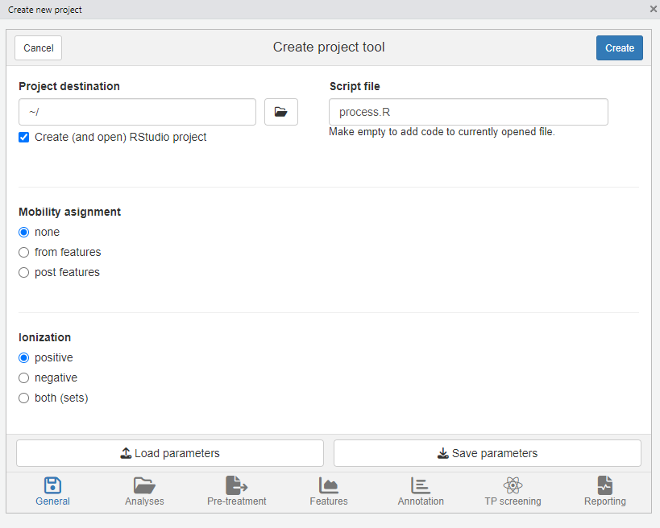

```{r setup, include = FALSE}
knitr::opts_chunk$set(
  collapse = TRUE,
  comment = "#>"
)
```

```{css code=readLines("styles.css"),echo=FALSE}
```


# Introduction


# Workflow

- overview of generator functions
- usage of algorithms: algorithm arg vs specific fun
- S4 classes?: common output, hierarchy, generics, ...

## Concepts

- show images of feature definition etc?

In a non-target workflow both chromatographic and mass spectral data is automatically processed in order to provide a comprehensive chemical characterization of your samples. While the exact workflow is typically dependent on the type of study, it generally involves of the following steps:

```{r workflow,echo=FALSE}
# UNDONE: show componentization alongside annotation (if possible)

DiagrammeR::grViz("
digraph rmarkdown {
  graph [ rankdir = LR, compound = true ]
  node [ shape = box,
         fixedsize = true,
         width = 2.6,
         height = 1,
         fontsize = 20,
         fillcolor = darkseagreen1,
         style = filled ]

  subgraph cluster1 {
    color=blue;
    'Data pre-treatment' -> 'Find features'
    'Find features' -> 'Group features'
    'Group features' -> 'MS peak lists'
  }
  
  subgraph cluster2 {
    'Suspect screening' -> 'Group features'
    'Find features' -> 'Suspect screening' [style=invis];
    'Group features' -> 'Suspect screening'
  }
  
  subgraph cluster3 {
    color=green;
    //edge [dir=none]
    'Formula annotation'  'Compound Annotation'  Componentization
  }
  
  subgraph cluster4 {
    Reporting
  }
  
  'MS peak lists' -> 'Formula annotation' [ltail=cluster1, lhead=cluster3]
  'Group features' -> Reporting [ltail=cluster1, lhead=cluster4]
  'Formula annotation' -> Reporting [ltail=cluster3, lhead=cluster4]
  
  
  /*'Group features' -> Annotation;
  'Group features' -> Componentization;
  
  Annotation -> Componentization;
  Componentization -> Annotation;
  
  Annotation -> Reporting;
  Componentization -> Reporting;*/
}", height = 250, width = 750)
```


<!-- UNDONE: optional lines (scheme/text below) -->

Note that `patRoon` supports flexible composition of workflows. In the scheme above you can recognize optional steps by a _XXX line/arrow_. Furthermore, the inclusion of each step is only necessary if a further steps depends on its data. For instance, annotation and componentization do not depend on each other and can therefore be executed in any different order or simply be omitted. A brief descripton of all steps is given below. 

During **data pre-treatment** raw MS data is prepared for further analysis. A common need for this step is to convert the data to an open format so that other tools are able to process it. Other pre-treatment steps may involve re-calibration of _m/z_ data or performing advanced filtering operations.

The next step is to extract **features** from the data. While different terminologies are used, a feature in `patRoon` refers to a single chromatographic peak in an extracted ion chromatogram for a single _m/z_ value (within a defined tolerance). Hence, a feature contains both chromatographic data (e.g. retention time and peak height) and mass spectral data (e.g. the accurate _m/z_). Note that with mass spectrometry multiple _m/z_ values may be detected for a single compound as a result of adduct formation, natural isotopes and/or in-source fragments. Some algorithms may try to combine these different masses in a single feature. However, in `patRoon` we generally assume this is not the case (and may optionally be done afterwards during the componentization step described below). Features are sometimes simply referred to as 'peaks'.

Features are found per analysis. Hence, in order to compare a feature across analyses, the next step is to group them. This step is essential as it finds equal features even if their retention time or _m/z_ values slightly differ due to analytical variability. The resulting **feature groups** are crucial input for subsequent workflow steps. Prior to grouping, _retention time alignment_ between analyses may be performed to improve grouping of features, especially when processing multiple analysis batches at once. Outside `patRoon` feature groups may also be defined as _profiles_, _aligned_ or _grouped features_ or _buckets_.

Depending on the study type, **suspect screening** is then performed to limit the features that should be considered for further processing. As its name suggests, with suspect screening only those features which are suspected to be present are considered for further processing. These suspects are retrieved from a suspect list which contains the _m/z_ and (optionally) retention times for each suspect. Typical suspect lists may be composed from databases with known pollutants or from predicted transformation products. Note that for a 'full' non-target analysis no suspect screening is performed, hence, this step is simply omitted and all features are to be considered.

After features have been collected the next step typically involves **annotation**. During this step MS and MS/MS data are collected in so called **MS peak lists**, which are then used as input for formula and compound annotation. Formula annotation involves automatic calculation of possible formulae for each feature based on its _m/z_, isotopic pattern and MS/MS fragments, whereas compound annotation (or identification) involves the assignment of actual chemical structures to each feature. Note that during formula and compound annotation typically multiple candidates are assigned to a single feature. To assist interpretation of this data each candidate is therefore ranked on characteristics such as isotopic fit, number of explained MS/MS fragments and metadata from an online database such as number of scientific references or presence in common suspect lists.

Besides annotation, another step to perform after extraction of features is **componentization**. A **component** is defined as a collection of multiple feature groups that are somehow related to each other. Typical exmples are features that belong to the same chemical compound (i.e. with different _m/z_ values but equal retention time), such as adducts, isotopes and in-source fragments. Other examples are homologues series and features that display a similar intensity trend across samples.

The final step of the workflow is to **report** the data. During this step all data from the workflow is reported graphically or in a text file format suitable to be loaded by other tools. Interactive reports can also be made which typically greatly improve data interpretation.

To summarize:

* **Data-pretreatment** involves preparing raw MS data for further processing (e.g. conversion to an open format)
* **Features** describe chromatographic and _m/z_ information (or 'peaks') in all analyses.
* A **feature group** consists of equal features across analyses.
* With **suspect screening** only features that are considered to be on a suspect list are considered further in the workflow.
* **MS peak lists** Summarizes all MS and MS/MS data that will be used for subsequent annotation.
* During **formula** and **compound annotation** candidate formulae/structures will be assigned and ranked for each feature.
* **Componentization** involves consolidating different feature groups that have a relationship to each other in to a single component.
* **Reporting** is performed as the final step to assist interpretation of the data generated during the workflow.

<!-- UNDONE: add link to example workflows? -->


## Generating workflow data

Each step in the non-target workflow is performed by a function that perform the heavy lifting of a workflow step behind the scenes and finally return the results. An important goal of `patRoon` is to support multiple algorithms for each workflow step, hence, when such a function is called you have to specify which algorithm you want to use. The available algorithms and their characteristics will be discussed in the next sections. An overview of all functions involved in generating workflow data is shown in the table below.

Workflow step         | Function                                          | Output S4 class
--------------------- | ------------------------------------------------- | ------------
Data pre-treatment    | `convertMSFiles()`, `recalibrarateDAFiles()`      | -
Finding features      | `findFeatures()`                                  | `features`
Grouping features     | `groupFeatures()`                                 | `featureGroups`
Suspect screening     | `screenTargets()` + `groupFeaturesScreening()`    | `featureGroups` 
MS peak lists         | `generateMSPeakLists()`                           | `MSPeakLists`
Formula annotation    | `generateFormulas()`                              | `formulas`
Compound annotation   | `generateCompounds()`                             | `compounds`
Componentization      | `generateComponents()`                            | `components`

All of these functions store their output in objects derived from so called S4 classes. Knowing the details about the S4 class system of `R` is generally not important when using `patRoon` (and well written resources are available if you want to know more). In brief, usage of this class system allows a general data format that is used irrespective of the algorithm that was used to generate the data. For instance, when features have been found by [OpenMS] or [XCMS] they both return the same data format.

Another advantage of the S4 class system is the usage of so called _generic functions_. To put simply: a generic function performs a certain task for different types of data objects. A good example is the `plotSpec()` function which plots an (annotated) spectrum from data of MS peak lists or from formula or compound annotation:

```{r plotSpec,eval=FALSE}
plotSpec(mslists, ...) # plot raw MS spectrum
plotSpec(formulas, ...) # plot annotated spectrum from formula annotation data
plotSpec(compounds, ...) # likewise but for compound annotation.
```

The next sections will further detail on how to actually perform the non-target workflow steps and use their output.

## Preparing the workflow

### Data pre-treatment

Prior to performing the actual non-target data processing workflow some preparations often need to be made. Often data has to be pre-treated, for instance, by converting it to an open format that is usable for subsequent workflow steps or to perform mass re-calibration. Some common functions are listed below.

Task                                |  Function                | Algorithms | Supported file formats
------------------------------------| ------------------------ | -------------------------------------- | -------
Conversion                          | `convertMSFiles()`       | [OpenMS], [ProteoWizard], DataAnalysis | All common (algorithm dependent)
Advanced (e.g. spectral filtering)  | `convertMSFiles()`       | [ProteoWizard]                         | All common
Mass re-calibration                 | `recalibrarateDAFiles()` | DataAnalysis                           | Bruker

The `convertMSFiles()` function supports conversion between many different file formats typically used in non-target analysis. Furthermore, other pre-treatment steps are available (e.g. centroiding, filtering) when the [ProteoWizard] algorithm is used. For an overview of these functionalities see the [MsConvert documentation]. Some examples:

```{r convert,eval=FALSE}
# Converts a single mzXML file to mzML format
convertMSFiles("standard-1.mzXML", to = "mzML", algorithm = "openms")

# Converts all Thermo files with ProteoWizard (the default) in the analyses/raw
# directory and stores the mzML files in analyses/raw. Afterwards, only MS1
# spectra are retained.
convertMSFiles("analyses/raw", "analyses/mzml", from = "thermo",
               centroid = "vendor", filters = "msLevel 1")
```

> **_NOTE_** Most algorithms require the _mzML_ or _mzXML_ file format and additionally require that mass peaks have been centroided. When using the ProteoWizard algorithm (the default), centroiding by vendor algorithms is generally recommended (i.e. by setting `centroid="vendor"` as shown in the above example).

When Bruker MS data is used it can be automatically re-calibrated to improve its mass accuracy. Often this is preceeded by calling the `setDAMethod()` function to set a DataAnalysis method to all files in order to configure automatic re-calibration. The `recalibrarateDAFiles()` function performs the actual re-calibration. The `getDACalibrationError()` function can be used at anytime to request the current calibration error of each analysis. An example of these functions is shown below.

```{r brukerCalib,eval=FALSE}
# anaInfo is a data.frame with information on analyses (see next section)
setDAMethod(anaInfo, "path/to/DAMethod.m") # configure Bruker files with given method that has automatic calibration setup
recalibrarateDAFiles(anaInfo) # trigger re-calibration for each analysis
getDACalibrationError(anaInfo) # get calibration error for each analysis (NOTE: also shown when previous function is finished)
```

### Analysis information

The final bits of preparation is constructing the information for the analyses that need to be processed. In `patRoon` this is referred to as the _analysis information_ and often stored in a variable `anaInfo` (of course you are free to choose a different name!). The analysis information should be a `data.frame` with the following columns:

* **path**: the directory path of the file containing the analysis data
* **analysis**: the name of the analysis. This should be the file name _without_ file extension.
* **group**: to which _replicate group_ the analysis belongs. All analysis which are replicates of each other get the same name.
* **ref**: which replicate group should be used for blank subtraction.
* **conc** (optional, advanced) A numeric value describing the concentration or any other value for which the intensity in this sample may correlate, for instance, dilution factor, sampling time etc. This column is only required when using the `regression()` function (see `?regression` for more information).

<!-- UNDONE: tutorial link? -->

The `generateAnalysisInfo()` function can be used to (semi-)automatically generate a suitable `data.frame` that contains all the required information for a set of analysis. For, instance, the following line was used in the tutorial:

```{r genAnaInfo,eval=FALSE}
# Take example data from patRoonData package (triplicate solvent blank + triplicate standard)
anaInfo <- generateAnalysisInfo(paths = patRoonData::exampleDataPath(),
                                groups = c(rep("solvent", 3), rep("standard", 3)),
                                refs = "solvent")
```

Alternatively, the `newProject()` function discussed in the next section can be used to interactively construct this information.

### Automatic project generation with newProject()

The previous sections already highlighted some steps that have to be performed prior to starting a new non-target analysis workflow: data pre-treatment and gathering information on the analysis. Most of the times you will put this and other `R` code a script file so you can re-call what you have done before (i.e. reproducbile research).

The `newProject()` function can be used to setup a new project. When you run this function it will launch a small tool (see screenshot below) where you can select your analyses and configure the various workflow steps which you want to execute (e.g. data pre-treatment, finding features, annotation etc). After setting everything up the function will generate a template script which can easily be edited afterwards. In addition, you have the option to create a new RStudio project, which is advantegeous as it neatly seperates your data processing work from the rest.

{width=450px}

> **_NOTE_** At the moment `newProject()` _only_ works with (recent) versions of RStudio.


## Features

<!-- UNDONE: enviMass? -->

Algorithm | Usage | Remarks
------------ | ----- | ------
[OpenMS] | `findFeatures(algorithm = "openms", ...)` | Uses the [FeatureFinderMetabo] algorithm
[XCMS] | `findFeatures(algorithm = "xcms", ...)` | Uses `xcms::xcmsSet()` function
[XCMS] (import) | `importFeatures(algorithm = "xcms")` | Imports an existing `xcmsSet` object.
[enviPick] | `findFeatures(algorithm = "envipick")` | Uses `enviPick::enviPickwrap()`
DataAnalysis | `findFeatures(algorithm = "bruker")` | Uses Find Molecular Features from DataAnalysis (Bruker only)


Algorithm | Usage | Remarks
--------- | ----- | ------
[OpenMS] | `groupFeatures(algorithm = "openms", ...)` | Uses the [FeatureFinderMetabo] algorithm
[XCMS] | `groupFeatures(algorithm = "xcms", ...)` | Uses `xcms::group()` function
ProfileAnalysis | `importFeatureGroups(algorithm = "brukerpa", ...)` | Import `.csv` file exported from Bruker ProfileAnalysis
TASQ | `importFeatureGroups(algorithm = "brukertasq", ...)` | Imports a _Global result table_ (exported to Excel file and then saved as `.csv` file)


- Table with algorithms and remarks about their selection
- Process: extract features --> align RT --> group (--> suspect screening)

## Annotation

- Adducts: conversion

### MS peak lists

- Table with algorithms and remarks about their selection
- Process: extract MS and MS/MS spectra per feature --> average --> average per group

### Formulae

- Table with algorithms and remarks about their selection
- Process: Calculate per feature (in)directly
- MS and MS/MS only
- OM rules: as.data.table() and filter()

### Compounds

- Table with algorithms and remarks about their selection
- database selection (MF) --> PC, CS (set key), CT (set opt), csv etc (set path)
- Process: download candidates --> rank candidates on X, Y, Z (--> add formula scoring)
- Timeouts & error handling
- Advanced?: RT/suspect scoring

## Components

- Table with algorithms and remarks about their selection

### RT components

- CAMERA and RAMClustR

### Homologues series

- nontarget
- linking/merging

### Intensity clustering

- Principle
- Cluster selection, normalization etc

## Reporting

# Advanced usage

## Filtering and inspecting data

- Filtering data: overview common filters, (fGroup) filtering order?, subsetting data
- Inspecting data: extraction operator, as.data.table(), specific accessors (e.g. groupInfo()), plotting?

## Feature parameter optimization

- Principle, IPO reference, extensions
- param sets, qualitiative optimization, generation of pSets
- Perform with subset of analyses
- Using results: get optimized object, best results, plot results

## Algorithm consensus

- fGroup comparison
- consensus selection (overlap/unique)

## Compound clustering

- Principle
- Cluster selection, MCS plotting
- methods

## Caching

```{r child="shared/refs.Rmd"}
```
