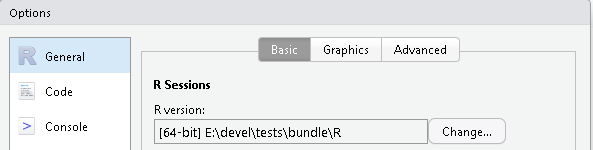

# Installation

This chapter outlines several strategies to install `patRoon` and its dependencies. These include other `R` packages and software tools external to `R`. The following strategies can largely automate this process, and will be discussed in the next sections:

1. The [patRoon bundle](#pBundle), which contains all dependencies (including `R`), and is therefore very easy to setup (currently _Windows only_).
2. Reproducible [Docker images](#Docker).
3. [Regular installations](#reg_inst) that integrate with the currently installed `R` environment.

The first strategy is recommended if you are using Windows and are new to `R`, or quickly want to try out the latest `patRoon` snapshot. [Docker] images are specifically for users who wish to run isolated containers and ensure high reproducibility. Finally, people already running `R` will most likely prefer the third strategy. Each strategy is discussed separately in the next sections.

## patRoon Bundle {#pBundle}

The `patRoon` bundle contains an almost full `patRoon` installation, including `R`, all `R` package dependencies and external software dependencies such as Java JDK, [MetFrag] and various compound libraries etc. Currently, only [ProteoWizard] may need to be [installed manually](#inst_man_ext).

The bundles are automatically generated and tested, and can be obtained from [the release page on GitHub][GHRel] for released versions of `patRoon` and [the latest pre-release on GitHub][GHPreRel] for the latest snapshot. 

After downloading the bundle, simply extract the `.zip` file. Then, a classic `R` terminal can be launched by executing `R/bin/x64/Rgui.exe` inside the directory where the bundle was extracted. However, it is probably more convenient to use it from [RStudio]:

Start RStudio --> Tools menu --> Global options --> General tab --> R version --> Change

Then, set the `R` version by selecting `Rterm.exe` from the `R/bin/x64` directory in the bundle (see screenshot below) and restart RStudio.

```{r bundle_rstudio,echo=FALSE}
if (knitr::is_html_output()) {
    knitr::include_graphics(knitr::image_uri("bundle.png"), error = FALSE)
} else
    
```


### Updating the bundle

To update the bundle run either of the following functions:

```{r eval=FALSE}
patRoonInst::sync(allDeps = TRUE) # synchronize all packages related to patRoon to the currently tested versions
patRoonInst::update() # update all R packages related to patRoon
```

Both functions will update `patRoon` and related packages to their latest versions. However, they differ on handling their dependencies.

In general, it is recommended to synchronize the package dependencies in the bundle, since this ensures that versions were tested with `patRoon`. If you installed any other packages and also want to update these, then _first_ do so with regular mechanisms (e.g. `update.packages()`, `BiocManager::install()`) and _then_ synchronize `patRoon` to ensure that all packages are with tested versions.

However, if you prefer to install the latest version of all dependencies, then running `patRoon::update()` might be more appropriate. In this case, it is still recommended to first update any 'regular' `R` packages as described above, as `patRoonInst::update()` may install some dependencies with a specific version in case other versions are known to not work.

More details on using `patRoonInst` to manage installations are discussed [later](#auto_inst).

### Details

This section describes details on the contents and the configuration of the `patRoon` bundle, and is mainly intended for readers who want to know more details or perform customizations.

The `patRoon` bundle consists of the following:

* A complete installation of `R`.
* An open java development kit (JDK) from [Adoptium]
* `patRoon` and its mandatory and optional `R` packages dependencies, synchronized from `patRoonDeps` ([discussed later](#auto_inst)).
* Most external dependencies _via_ [patRoonExt] (also [discussed later](#pExt))

The `R` Windows installers are extracted with [innoextract] to obtain a 'portable' installation. The `Renviron.site` and `Rprofile.site` files are then generated to ensure that the bundled JDK will be used, `R` packages will be loaded and installed from the bundle and various other configurations are applied to ensure that the bundle will not conflict with a regular `R` installation.

The bundles are automatically generated, and the relevant script can be [found here](https://github.com/rickhelmus/patRoonDeps/blob/master/utils/make_bundle.R). 

## Docker image {#Docker}

Docker images are provided to easily install a reproducible environment with `R`, `patRoon` and nearly all of its dependencies. This section assumes you have a basic understanding of [Docker] and have it installed. If not, please refer to the many guides available on the Internet. The Docker images of `patRoon` were originally only used for automated testing, however, since these contain a complete working environment of `patRoon` they are also suitable for using the software. They come with all external dependencies (except ProteoWizard), `R` dependencies and `MetFrag` libraries. Furthermore, the Docker image also contains [RStudio] server, which makes using `patRoon` even easier.

Below are some example shell commands on how to run the image.

```{bash, eval=FALSE}
# run an interactive R console session
docker run --rm -it uva-hva.gitlab.host:4567/r.helmus/patroon/patroonrs

# run a linux shell, from which R can be launched
docker run --rm -it uva-hva.gitlab.host:4567/r.helmus/patroon/patroonrs bash

# run rstudio server, accessible from localhost:8787
# login with rstudio/yourpasswordhere
docker run --rm -p 8787:8787 -u 0 -e PASSWORD=yourpasswordhere uva-hva.gitlab.host:4567/r.helmus/patroon/patroonrs /init

# same as above, but mount a local directory (~/myvolume) as local volume so it can be used for persistent storage
# please ensure that ~/myvolume exists!
docker run --rm -p 8787:8787 -u 0 -e PASSWORD=yourpasswordhere -v ~/myvolume:/home/rstudio/myvolume uva-hva.gitlab.host:4567/r.helmus/patroon/patroonrs /init
```

Note that the first two commands run as the default user `rstudio`, while the last two as `root`. The last commands launch [RStudio] server. You can access it by browsing to `localhost:8787` and logging in with user `rstudio` and the password defined by the `PASSWORD` variable from the command (`yourpasswordhere` in the above example). The last command also links a local volume in order to obtain persistence of files in the container's home directory. The Docker image is based on the excellent work from the [rocker project](https://www.rocker-project.org/). For more information on RStudio related options see their documentation for the [RStudio image].

## Regular R installation {#reg_inst}

A 'regular' installation involves installing `patRoon` and its dependencies using the local installation of `R`. This section outlines available tools to do this mostly automatically using the auxiliary [patRoonInst] and [patRoonExt] `R` packages, as well as instructions to perform the complete installation manually.

> **_NOTE_**  It is highly recommended to perform installation steps in a 'clean' `R` session to avoid errors when installing or upgrading packages. As such it is recommended to close all open (R Studio) sessions and open a plain R console to perform the installation. 

### Automatic installation {#auto_inst}

The [patRoonInst] auxiliary package simplifies the installation process. This package automatically installs all `R` package dependencies, including those unavailable from regular repositories such as CRAN and BiocConductor. Furthermore, `patRoonInst` installs [patRoonExt], an `R` package that bundles most common dependencies external to the `R` environment (e.g. [MetFrag], [OpenMS] etc).

The first step is to install `patRoonInst`:

```{r eval=FALSE}
install.packages("patRoonInst", repos = c('https://rickhelmus.r-universe.dev', 'https://cloud.r-project.org'))

# or alternatively, from GitHub
install.packages("remotes") # run this in case the remotes (or devtools) package is not yet installed
remotes::install_github("rickhelmus/patRoonInst")
```

Then to perform an installation or update:

```{r eval=FALSE}
patRoonInst::install() # install patRoon and any missing dependencies
patRoonInst::update() # update patRoon and its dependencies
```

The installation can be customized in various ways. Firstly, the repositories used to download R packages can be customized through the `origin` argument. The following options are currently available:

* `patRoonDeps`: contains `patRoon` and its dependencies (including _their_ dependencies) with versions that were tested against the latest `patRoon` version. This repository is used for the [patRoon bundle](#pBundle), and only available for Windows systems.
* r-universe: contains a snapshot of the latest version of `patRoon` and its direct dependencies.
* "regular": in this case packages will be sourced directly from CRAN/BioConductor or GitHub. This means that suitable build tools (e.g. [Rtools] on Windows) need to be available during installation.

The default on Windows systems is `patRoonDeps`, and r-universe otherwise. Note that both repositories only provide packages for recent `R` versions.

Other installation customizations include which packages will be installed (or updated), and installing all packages to an isolated `R` library. Some examples:

```{r eval=FALSE}
# install from r-universe
patRoonInst::install(origin = "runiverse")
# only install patRoon, without optional dependencies and directly from GitHub
patRoonInst::install(origin = "regular", pkgs = "patRoon")
# full installation, except two selected packages
patRoonInst::install(ignorePkgs = c("nontarget", "MetaClean"))
# full installation, but exclude 'big' optional dependencies such as example data (patRoonData)
patRoonInst::install(ignorePkgs = "big")
# install everything to an isolated R library (use .libPaths() to use it)
patRoonInst::install(lib.loc = "~/patRoon-lib")
```

Besides installing and updating packages, it is also possible to _synchronize_ them with the selected repository using the `sync()` function. This is mostly the same as `update()`, but can also downgrade packages to ensure their versions exactly match that of the repository. This is currently only supported for the `patRoonDeps` repository. Furthermore, as synchronization may involve downgrading it is intended for environments that are primarily used for `patRoon`, such as the [bundle](#pBundle) and isolated `R` libraries. Synchronization can be performed for all or only direct dependencies:

```{r eval=FALSE}
patRoonInst::sync(allDeps = TRUE) # synchronize all dependencies
patRoonInst::sync(allDeps = FALSE) # synchronize only direct dependencies
```

More options are available to customize the installation, see the reference manual (`?patRoonInst::install`) for more details.

### Manual installation

A manual installation starts with installing external dependencies, followed by `R` dependencies and `patRoon` itself.

#### External (non-R) dependencies

`patRoon` interfaces with various software tools that are external to `R`. A complete overview is given in the table below

Dependency                          | Remarks
----------------------------------- | -----------------------------------------------------
[Java JDK][JavaJDK]                 | **Mandatory** for e.g. plotting structures and using MetFrag.
[OpenBabel]                         | **Highly recommend** Used by e.g. suspect screening to automatically validate and calculate chemical properties such as InChIs and formulae. While optional, highly recommended.
[Rtools]                            | May be necessary on Window when installing `patRoon` and its `R` dependencies (discussed later).
[ProteoWizard]                      | Needed for automatic data-pretreatment (e.g. data file conversion and centroiding, Bruker users may use DataAnalysis integration instead).
[OpenMS]                            | Recommended. Used for e.g. finding and grouping features.
[MetFrag CL][MetFragCL]             | Recommended. Used for annotation with MetFrag.
[MetFrag CompTox DB][CompTox-dl]    | Database files necessary for usage of the [CompTox] database with MetFrag. Note that a recent version  of MetFrag (>=2.4.5) is required. Note that the lists with additions for [smoking metadata][CompTox-smoke] and [wastewater metadata][CompTox-WW] are also supported.
[MetFrag PubChemLite DB][PCLite-dl] | Database file needed to use [PubChemLite][PCLite-paper] with MetFrag.
[MetFrag PubChem OECD PFAS DB][PC-PFAS] | Database file to use the OECD PFAS database with MetFrag.
[SIRIUS]                            | For obtaining feature data and formula and/or compound annotation.
[BioTransformer]                    | For prediction of transformation products. See the [BioTransformer] page for installation details. If you have trouble compiling the jar file you can download it from [here](https://github.com/rickhelmus/patRoonExt/raw/master/tools/biotransformer-3.0.0.jar).
[SAFD]                              | For finding features with [SAFD]. Please follow all the installation on the [SAFD webpage][SAFD].
[pngquant]                          | Used to reduce size of HTML reports (only legacy interface), definitely optional.

Most of these dependencies are optional and only needed if their algorithms are used during the workflow.

##### Installation via `patRoonExt` {#pExt}

The [patRoonExt] auxiliary package automatizes the installation of most common external dependencies. For installation, just run:

```{r eval=FALSE}
install.packages("remotes") # run this if remotes (or devtools) is not already installed
remotes::install_github("rickhelmus/patRoonExt")
```

> **_NOTE_** Make sure you have an active internet connection since several files will be downloaded during the installation of `patRoonExt`.

Note that when you do an [automated patRoon installation](#auto_inst) this package is automatically installed. See the [project page][patRoonExt] for more details, including ways to customize which software tools will be installed.

> **_NOTE_** Currently, `patRoonExt` does not install ProteoWizard due to license restrictions, and some tools, such as [OpenMS] and [OpenBabel], are only installed on Windows systems. See the next section to install any missing tools manually.

##### Manually installing and configuring external tools {#inst_man_ext}

Download the tools manually from the linked sources shown in the table above, and subsequently install (or extract) them. You may need to configure their file paths afterwards (`OpenMS`, `OpenBabel` and `ProteoWizard` are often found automatically). To configure the file locations you should set some global package options with the `options()` `R` function, for instance:

```{r, eval=FALSE}
options(patRoon.path.pwiz = "C:/ProteoWizard") # location of ProteoWizard installation folder
options(patRoon.path.SIRIUS = "C:/sirius-win64-3.5.1") # directory with the SIRIUS binaries
options(patRoon.path.OpenMS = "/usr/local/bin") # directory with the OpenMS binaries
options(patRoon.path.pngquant = "~/pngquant") # directory containing pngquant binary
options(patRoon.path.MetFragCL = "~/MetFragCommandLine-2.4.8.jar") # full location to the jar file
options(patRoon.path.MetFragCompTox = "C:/CompTox_17March2019_SelectMetaData.csv") # full location to desired CompTox CSV file
options(patRoon.path.MetFragPubChemLite = "~/PubChemLite_exposomics_20220429.csv") # full location to desired PubChemLite CSV file
options(patRoon.path.MetFragPubChemLite = "~/PubChem_OECDPFAS_largerPFASparts_20220324") # full location to PFAS DB (NOTE: configured like PubChemLite)
options(patRoon.path.BioTransformer = "~/biotransformer/biotransformer-3.0.0.jar")
options(patRoon.path.obabel = "C:/Program Files/OpenBabel-3.0.0") # directory with OpenBabel binaries
```

These commands have to be executed every time you start a new `R` session (e.g. as part of your script). However, it is probably easier to add them to your `~/.Rprofile` file so that they are executed automatically when you start `R`. If you don't have this file yet you can simply create it yourself (for more information see e.g. [this SO answer](https://stackoverflow.com/a/46819910)).

> **_NOTE_** The tools that are configured through the `options()` described above will **_override_** any tools that were _also_ installed through `patRoonExt`. Hence, this mechanism can be used to use specific versions not available though `patRoonExt`. However, this also means that you need to ensure that options are unset when you prefer that tools are used through `patRoonExt`.

#### Installing patRoon and its R dependencies

The table below lists all the `R` packages that are involved in the installation of `patRoon`.

```{r echo=FALSE}
source("get_rdeps.R")
tab <- getRDepsTab(if (knitr::is_html_output()) "html" else "latex")

if (knitr::is_html_output())
{
    k <- knitr::kable(tab, format = "html", escape = FALSE)
    k <- kableExtra::kable_styling(k, font_size = 12)
    k <- kableExtra::scroll_box(k, extra_css = "overflow-y: auto; height: 350px;")
} else
{
    # UNDONE: set escape=TRUE for now, since we cannot seem to make hrefs (see getRDepsTab())
    k <- knitr::kable(tab, format = "latex", booktabs = TRUE, escape = TRUE)
    k <- kableExtra::kable_styling(k, font_size = 7)
}

k
```

Note that only the `CAMERA` installation is mandatory, the rest involves installation of _optional_ packages. If you are unsure which you need then you can always install the packages at a later stage.

The last three columns of the table provide hints on the availability from the `patRoonDeps`, r-universe and original regular sources (the sources were [discussed previously](#auto_inst)). Note that you may need to install `remotes`, `BiocManager` and [Rtools] if packages are installed from their regular source. Some examples are shown below:

```{r eval=FALSE}

# Install patRoon (and its mandatory dependencies) from patRoonDeps
install.packages("patRoon", repos = "https://rickhelmus.github.io/patRoonDeps", type = "binary")

# Install KPIC2 from r-universe
install.packages("KPIC", repos = c('https://rickhelmus.r-universe.dev', 'https://cloud.r-project.org'))

# Install the mandatory CAMERA package (will be installed automatically if using patRoonDeps/r-universe)
install.packages("BiocManager") # execute this if 'BiocManager' is not yet installed
BiocManager::install("CAMERA")

# Install patRoonData from GitHub
install.packages("remotes") # execute this if remotes (or devtools) is not yet installed
remotes::install_github("rickhelmus/patRoonData")
```

### Verifying the installation

After the installation is completed, you may need to restart `R`. Afterwards, the `verifyDependencies()` function can be used to see if `patRoon` can find all its dependencies:

```{r eval=FALSE}
patRoon::verifyDependencies()
```


## Managing legacy installations

Previous `patRoon` versions (`<2.3`) could be installed via an installation script. This script is now deprecated and replaced by the previously discussed installation methods. If you used this script in the past, and would like to update `patRoon`, it is important to first disable or fully remove the legacy installation. This is easily accomplished by the `patRoonInst` package that [was discussed before](#auto_inst):

```{r eval=FALSE}
patRoonInst::toggleLegacy(FALSE) # disable legacy installation
patRoonInst::removeLegacy() # remove all files part of the legacy installation
patRoonInst::removeLegacy(restoreRProfile = TRUE) # as above, and remove any automatic changes that were made in ~/.Rprofile
```

> **_NOTE_** Restart `R` afterwards to ensure all changes are in effect. 

For more details, please refer to the reference manual (`?patRoonInst::legacy`).


```{r child=file.path(vignDir, "shared", "_refs.Rmd")}
```
