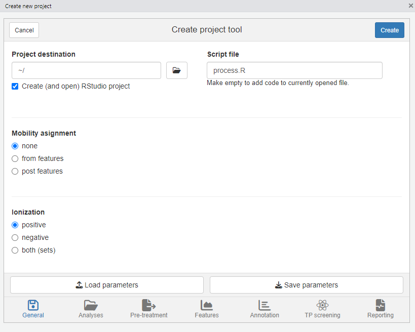

```{r setup, include = FALSE}
knitr::opts_chunk$set(
    error = FALSE
)

source(file.path("shared", "init.R"))
doCompounds <- TRUE # curl::has_internet()
```

```{css code=readLines("styles.css"),echo=FALSE}
```


# Introduction

<!-- UNDONE: link to advanced vignette -->

In this tutorial you will learn how to perform a simple non-target analysis with `patRoon`. This tutorial is not meant to give a detailed overview of `patRoon`. Instead, it serves as a quick introduction on how to use `patRoon` to setup and perform a full non-target analysis workflow.

The workflow in this tutorial consists of the following steps:

```{r workflow,echo=FALSE,out.width="75%"}
plotGV("
digraph rmarkdown {
graph [ rankdir = LR ]
node [ shape = box,
       fixedsize = true,
       width = 2.2,
       height = 1,
       fontsize = 18,
       fillcolor = darkseagreen1,
       style = filled ]
'New project' -> Features -> Annotation -> Reporting [ arrowhead = vee ]
}
", height = 100, width = 750)
```


# Data

In this tutorial we will use example data provided within the [patRoonData] package. Please make sure this package is installed (see the [readme] for brief installation instructions). The example dataset contains LC-MS data for a standard mixture with known composition ('standard-X') and a blank solvent ('solvent-X'), both in triplicate. While this may not seem like the most exciting data, it does allow to demonstrate the most important functionalities of `patRoon`.

<!-- UNDONE: Move/Refer below to other vignette -->

The provided analyses already have been exported to an open format (_.mzML_) and are ready to use. For your own data it may be necessary to first  export your data to _mzXML_ or _mzML_ and perform other data pre-treatment steps such as mass re-calibration. This can be done using the tools from [ProteoWizard] or software from your mass spectrometer vendor. Alternatively, `patRoon` can do this automatically for your analyses with the `convertMSFiles()` function. Please see the reference manual or other vignettes for its usage.

# New project

Whenever you start a new non-target analysis it is highly recommended to start this from a fresh _project directory_. This directory will contain your `R` processing script(s) and any other output generated during the workflow. Note that this directory does not have to contain the raw MS data files. In fact, keeping these files separate may be handy, for instance, if you want to run multiple non-target analyses on these files or store the analysis files on a shared location.

Starting a new project typically consists of

1. Creating a new directory (unsurprisingly!)
2. Changing the active working directory to the project directory (e.g. with `setwd()`).
3. Create (or copy) an `R` processing script.

Note that step 2 is important as any output files (e.g. reports and cached results) are stored to the current working directory by default. Consequently, always take care to ensure that this directory is active, for instance, after restarting `R`.

Steps 1-3 can be easily performed with the `newProject()` function. Alternatively, you can of course also perform these steps yourself. Both approaches will be discussed in the next sections.

## Automatic project creation

Ensure that RStudio is active and start the new project utility:

```{r eval=FALSE}
patRoon::newProject()
```

> **_NOTE_** Currently `newProject()` _only_ works when using RStudio.

A dialog should pop-up (see screenshot below) where you can specify where and how the new project will be generated, which analyses you want to include and define a basic workflow. Based on this input a new project with a template script will be automatically generated.

{width=450px}

For this tutorial make the following selections

* **Destination tab** Select your desired location of the new project. Leave other settings as they are.
* **Analyses tab** Here you normally select your analyses. However, for this tutorial simply select the _Example data_ option.
* **Data pre-treatment tab** Since the example data is already ready to use you can simply skip this tab.
* **Features tab** Leave the default OpenMS algorithm for feature finding and grouping.
* **Annotation tab** Select _GenForm_, _MetFrag_ and _mzR_ for the formula generation, compound identification and peak list generator options, respectively (note that the last will become visible when selecting either of the other options). Select _RAMClustR_ for component generation.
* **Reporting tab** Make sure all options are enabled (the `reportPDF()` and `reportHTML()` functions largely overlap each other in functionality, but are both enabled for demonstration purposes).

## Manual project creation

For RStudio users it is easiest to simply create a new RStudio project (e.g. _File_ --> _New Project_). This will create a new directory and ensure that the working directory is set whenever you re-open it. Alternatively, you can do this manually, for instance:

```{r eval=FALSE}
projDir <- "~/myProjectDir"
dir.create(projDir)
setwd(projDir)
```

The next step is to create a new `R` script. For this tutorial simply copy the script that is shown in the next section to a new `.R` file.

## Template R script

After you ran `newProject()` the file below will be created. Before running this script, however, we still have to add and modify some of its code. In the next sections you will learn more about each part of the script, make the necessary changes and run its code.

```{r scriptPre,code=readLines("script-pre.R"),eval=FALSE}
```


# Workflow

Now that you have generated a new project with a template script it is time to make some minor modifications and run it afterwards. In the next sections each major part of the script (initialization, finding and grouping features, annotation and reporting) will be discussed separately. Each section will briefly discuss the code, what needs to be modified and finally you will run the code. In addition, several functions will be demonstrated that you can use to inspect generated data. 

## Initialization

The first part of the script loads `patRoon`, makes sure the current working directory is set correctly and loads information about the analyses. This part in your script looks more or less like this:

```{r init,eval=FALSE}
library(patRoon)

workPath <- "C:/my_project"
setwd(workPath)


# Take example data from patRoonData package (triplicate solvent blank + triplicate standard)
anaInfo <- generateAnalysisInfo(paths = patRoonData::exampleDataPath(),
                                groups = c(rep("solvent", 3), rep("standard", 3)),
                                blanks = "solvent")
```

```{r doInit,include=FALSE}
# negative numeric eval option to disable lines is useless nowadays as it
# visually comments out the code --> guess we need two blocks
# https://github.com/yihui/knitr/issues/558

library(patRoon)

# Take example data from patRoonData package (triplicate solvent blank + triplicate standard)
anaInfo <- generateAnalysisInfo(paths = patRoonData::exampleDataPath(),
                                groups = c(rep("solvent", 3), rep("standard", 3)),
                                blanks = "solvent")
```

After you ran this part the analysis information should be stored in the `anaInfo` variable. This information is important as it will be required for subsequent steps in the workflow. Lets peek at its contents:

```{r anaInfo}
anaInfo
```

As you can see the generated `data.frame` consists of four columns:

* *path*: the directory path of the file containing the analysis data
* *analysis*: the name of the analysis. This should be the file name _without_ file extension.
* *group*: to which _replicate group_ the analysis belongs. All analysis which are replicates of each other get the same name.
* *blank*: which replicate group should be used for blank subtraction.

The latter two columns are especially important for [data cleanup](#data-cleanup), which will be discussed later. For now keep in mind that the analyses for the solvents and standards each belong to a different replicate group (`"solvent"` and `"standard"`) and that the solvents should be used for blank subtraction.

In this tutorial the analysis information was generated by the `generateAnalysisInfo()` function. This function will scan a given directory for MS data files and automatically fill in the `path` and `analysis` columns from this information. In addition, you can pass replicate group and blank information to this function as was done in the code above.

> **_NOTE_** Of course nothing stops you from creating a `data.frame` with analysis information manually within `R` or load the information from a _csv_ file. In fact, when you create a new project with `newProject()` you can select to generate a separate _csv_ file with analysis information (i.e. by filling in the right information in the analysis tab).

> **_NOTE_** The blanks for the solvent analyses are set to themselves. This will remove any features from the solvents later in the workflow, which is generally fine as we are usually not interested in the blanks anyway.


# Find and group features

The first step of a LC-MS non-target analysis workflow is typically the extraction of so called 'features'. While sometimes slightly different definitions are used, a feature can be seen as a single peak within an extracted ion chromatogram. For a complex sample it is not uncommon that hundreds to thousands of features can extracted. Because these large numbers this process is typically automatized nowadays.

To obtain all the features within your dataset the `findFeatures` function is used. This function requires data on the analysis information (`anaInfo` variable created earlier) and the desired algorithm that should be used. On top of that there are many more options that can significantly influence the feature finding process, hence, it is important to evaluate results afterwards.

In this tutorial we will use the [OpenMS] software to find features and stick with default parameters:

```{r features}
fList <- findFeatures(anaInfo, "openms")
```

After some processing time (especially for larger datasets), the next step is to _group features_. During this step, features from different analysis are grouped, optionally after alignment of their retention times. This grouping is necessary because it is common that instrumental errors will result in (slight) variations in both retention time and _m/z_ values which may complicate comparison of features between analyses. The resulting groups are referred to as **feature groups** and are crucial input for subsequent workflow steps.

To group features the `groupFeatures()` function is used, which has similar argument requirements as `findFeatures()` and likewise has many more options to tune the process. 

```{r fGroups}
fGroups <- groupFeatures(fList, "openms")
```

## Data clean-up {#data-cleanup}

The next step is to perform some basic rule based filtering with the filter() function. As its name suggests this function has several ways to filter data. It is a so called generic function and methods exists for various data types, such as the feature groups object that was made in the previous section (stored in the the `fGroups` variable).

```{r filtering}
fGroups <- filter(fGroups, preAbsMinIntensity = 100, absMinIntensity = 10000,
                  relMinReplicateAbundance = 1, maxReplicateIntRSD = 0.75,
                  blankThreshold = 5, removeBlanks = TRUE,
                  retentionRange = NULL, mzRange = NULL)
```


The following filterings steps will be performed:

* Features are removed if their intensity is below a defined intensity threshold (set by `absMinIntensity`). This filter is an effective way to  not only remove 'noisy' data, but, for instance, can also be used to remove any low intensity features which likely miss MS/MS data.
* If a feature is not ubiquitously present in (part of) replicate analyses it will be filtered out from that replicate group. This is controlled by setting `relMinReplicateAbundance`. The value is relative, for instance, a value of `0.5` would mean that a feature needs to be present in half of the replicates. In this tutorial we use a value of `1` which means that a feature should be present in all replicate samples. This is a _very_ effective filter in removing any outliers, for instance, caused by features which don't actually represent a well defined chromatographic peak.
* Similarly, features with within a replicate group are removed if the relative standard deviation (RSD) of their intensities exceeds that of the value set by the `maxReplicateIntRSD` argument.
* Features are filtered out that do not have a significantly higher intensity than the blank intensity. This is controlled by `blankThreshold`: the given value of `5` means that the intensity of a feature needs to be at least five times higher compared to the (average) blank signal.

The `removeBlanks` argument tells will remove all blank analyses after filtering. The `retentionRange` and `mzRange` arguments are not used here, but could be used to filter out any features outside a give retention or _m/z_ range. There are many more filters: see `?filter()` for more information.

As you may have noticed quite a large part of the features are removed as a result of the filtering step. However, using the right settings is a very effective way to separate interesting data from the rest.

<!-- UNDONE: add link below to other vignette when it contains prioritization -->

The next logical step in a non-target workflow is often to perform further prioritization of data. However, this will not be necessary in this tutorial as our samples are just known standard mixtures.

## Inspecting results

In order to have a quick peek at the results we can use the default printing method:

```{r showFG}
fGroups
```

Furthermore, the `as.data.table()` function can be used to have a look at generated feature groups and their intensities (_i.e._ peak heights) across all analyses:

```{r gTable}
head(as.data.table(fGroups))
```

An overview of group properties is returned by the `groupInfo()` method:
```{r gInfo}
head(groupInfo(fGroups))
```

Finally, we can have a quick look at our data by plotting some nice extracted ion chromatograms (EICs) for all feature groups:

```{r plotChroms,fig.width=7}
plotChroms(fGroups, colourBy = "fGroups", showFGroupRect = FALSE, showPeakArea = TRUE,
           topMost = 1, showLegend = FALSE)
```

Note that here we only plot the most intense feature of a feature group here (as set by `topMost=1`). See the reference docs for many more parameters to these functions (e.g. `?plotChroms`).

# Annotation

## MS peak lists

After obtaining a good dataset with features of interest we can start moving to find their chemical identity. Before doing so, however, the first step is to extract all relevant MS data that will be used for annotation. The tutorial data was obtained with data-dependent MS/MS, so in the ideal case we can obtain both MS and MS/MS data for each feature group.

The `generateMSPeakLists()` function will perform this action for us and will generate so called _MS peak lists_ in the process. These lists are basically (averaged) spectra in a tabular form. We will use algorithms from the [mzR] package to do so:

```{r MSPeakLists}
avgPListParams <- getDefAvgPListParams(clusterMzWindow = 0.002)
mslists <- generateMSPeakLists(fGroups, "mzr", maxMSRtWindow = 5, precursorMzWindow = 4,
                              avgFeatParams = avgPListParams, avgFGroupParams = avgPListParams)
```

Note that we lowered the `clusterMzWindow` value to _0.002_. This window is used during averaging to cluster similar _m/z_ values together. In general the better the resolution of your MS instrument, the lower the value can be set.

Similar to feature groups the `filter()` generic function can be used to clean up the peak lists afterwards:

```{r MSPLF}
mslists <- filter(mslists, relMSMSIntThr = 0.02, topMSMSPeaks = 10)
```

Here, all MS/MS mass peaks with intensities below 2% are removed and from the remaining peaks no more than the ten most intense are retained.

## Formula calculation

Using the data from the MS peak lists generated during the previous step we can generate a list of formula candidates for each feature group which is based on measured _m/z_ values, isotopic patterns and presence of MS/MS fragments. In this tutorial we will use this data as an extra hint to score candidate chemical structures generated during the next step. The command below will use [GenForm] to perform this step. Again running this code may take some time.

```{r formulas}
formulas <- generateFormulas(fGroups, "genform", mslists, relMzDev = 5,
                             adduct = "[M+H]+", elements = "CHNOPSCl",
                             calculateFeatures = TRUE, featThreshold = 0.75)
```

Note that you need to change the elements parameter to this function to make sure that formulae with sulfur and chloride (S/Cl) are also accepted. It is highly recommended to limit the elements (by default it is just C, H, N, O and P) as this can significantly reduce processing time and improbable formula candidates. In this tutorial we already knew which compounds to expect so the choice was easy, but often a good guess can be made in advance.

> **_NOTE_** The `generateFormulas()` function returns an object that contains formula candidates assigned for each feature group. In the above call the `calculateFeatures` argument is set to `TRUE`: by doing so formulae are first calculated for individual features within a feature group. These results are then used to generate a consensus candidate formula list for the complete feature group. During this process any outliers (defined by `featThreshold`) are automatically removed. In contrast, setting `calculateFeatures` to `FALSE` will calculate formulae directly for feature groups (by using MS peak lists that have been averaged for the whole group). This will be significantly faster, but might produce (slightly) less accurate results.

## Compound identification

<!-- UNDONE Move MF installation to front? -->

Now it is time to actually see what compounds we may be dealing with. In this tutorial we will use [MetFrag] to come up with a list of possible candidates structures for each feature group. Before we can start you have to make sure that MetFrag can be found by `patRoon`. Download the [MetFrag CLI jar file][MetFragCL] and specify its file location: 

```{r MF_opt,eval=FALSE}
# change to the full path of the MetFrag CL jar file
options(patRoon.path.MetFragCL = "~/MetFrag2.4.5-CL.jar")
```

Then `generateCompounds()` is used to execute MetFrag and generate the `compounds`.

```{r compounds,eval=doCompounds}
compounds <- generateCompounds(fGroups, mslists, "metfrag", method = "CL",
                               dbRelMzDev = 5, fragRelMzDev = 5, fragAbsMzDev = 0.002,
                               adduct = "[M+H]+", database = "pubchem", maxCandidatesToStop = 5000)
```

While `generateCompounds()` is running a list of candidate compound structures will be downloaded for every feature group and ranked according to various scoring parameters.

In this case we are using the [PubChem] database to retrieve candidates. Other commonly databases are [ChemSpider] and EPA's [CompTox]. See `?generateCompounds()` for more information on possible databases and many other parameters that can be set.

> **_NOTE_** You may get several warnings for feature groups for which no compounds could be searched. Usually this is because we set a hard limit with the `maxCandidatesToStop` argument. Increasing this value is tempting, however, the compounds are searched through an online database and processing thousands of candidates takes too much time (and is not nice towards the servers running MetFrag!). An obvious drawback is that you will not get any results for feature groups with many candidates (however, these are generally difficult to sort out anyway!).

> **_NOTE_** This is often one of the most time consuming steps during the workflow. For this reason, and in order to not 'abuse' the servers used by MetFrag, you should always take care to prioritize your data before running this function!

Finally we use the `addFormulaScoring()` function to improve ranking of candidates by incorporating the formula calculation data from the previous step.

```{r fscoring,eval=doCompounds}
compounds <- addFormulaScoring(compounds, formulas, updateScore = TRUE)
```

```{r noint,include=FALSE,eval=!doCompounds}
compounds <- NULL
```

## Inspecting results

Similar as feature groups we can quickly peek at some results:

```{r annRes,eval=doCompounds}
mslists
formulas
compounds

as.data.table(mslists)
as.data.table(formulas)[, 1:7] # only show first columns for clarity
as.data.table(compounds)[, 1:5] # only show first columns for clarity
```

```{r plotSpectrum,fig.width=6,fig.height=3.5,eval=doCompounds}
plotSpectrum(mslists, "M186_R265_296", MSLevel = 2)
plotSpectrum(formulas, "C6H8N2", "M109_R116_56", MSPeakLists = mslists)
plotSpectrum(compounds, 1, "M120_R328_81", mslists)
```

# Components

So far we mainly dealt with feature groups as if they are separate chemical compounds. However, formation of multiple ionization adducts (_e.g._ from sodium and potassium), isotopologues and/or in-source fragments may yield multiple _m/z_ values for the same compound. As a result, multiple feature groups may be describing the same chemical compound. To reduce this complexity it is useful to generate so called _components_ which are basically groups of feature groups which are likely to be the same compound (based on _e.g._ similarity of retention profiles). Afterwards,  feature groups present in a component are annotated based on known chemical rules, which may further help compound identification.

Generating components is performed with the `generateComponents()` function:

```{r components}
components <- generateComponents(fGroups, "ramclustr", ionization = "positive")
```

The results can be inspected similarly as seen before:

```{r fig.width=5,fig.height=4}
components
plotSpectrum(components, "CMP6")
plotChroms(components, "CMP6", fGroups)
```

> **_NOTE_** The componentization process must currently be seen as a tool to provide hints on how different features _may_ be related to each other. Hence, results should always be checked manually, for instance, by the above commands or with the reports generated in the next step. For this reason, features that were annotated as e.g. adducts or fragments should not be blindly removed.

# Reporting

The last step of the workflow is typically reporting data: during this step all the collected data is transformed to graphical plots (`reportPDF()` and `reportHTML()`) or tabular csv data (`reportCSV()`).

```{r eval=FALSE}
reportCSV(fGroups, path = "report", reportFeatures = FALSE, formulas = formulas,
          compounds = compounds, compoundsNormalizeScores = "max",
          components = components)

reportPDF(fGroups, path = "report", reportFGroups = TRUE, formulas = formulas, reportFormulaSpectra = TRUE,
          compounds = compounds, compoundsNormalizeScores = "max",
          components = components, MSPeakLists = mslists)

reportHTML(fGroups, path = "report", reportPlots = c("chord", "venn", "upset", "eics", "formulas"),
           formulas = formulas, compounds = compounds, compoundsNormalizeScores = "max",
           components = components, MSPeakLists = mslists,
           selfContained = FALSE, openReport = TRUE)
```

The output of `reportHTML()` can be viewed [here](../examples/report.html).

Note that these functions can be called at any time during the workflow. This may be especially useful if you want evaluate results during optimization or exploring the various algorithms and their parameters. In this case you can simply cherry pick the data that you want to report, for instance:

```{r eval=FALSE}
# only report feature groups (i.e. the bare minimum)
reportCSV(fGroups, path = "report", reportFeatures = FALSE)

# report compounds. Note that MSPeakLists (mslists variable) are required for formula/compound reporting
reportPDF(fGroups, path = "report", reportFGroups = TRUE,
          compounds = compounds, compoundsNormalizeScores = "max",
          MSPeakLists = mslists)

# only report components
reportHTML(fGroups, path = "report", reportPlots = c("chord", "venn", "upset", "eics"),
           components = components
           selfContained = FALSE, openReport = TRUE)
```

```{r echo=FALSE,eval=pkgdown::in_pkgdown()}
# do the actual reporting here

# ugly work around for nested rmarkdown call made by reportHTML; based on https://gist.github.com/jennybc/1f747c5bb84aa9be9c3c
tempF <- tempfile(); tempScript <- tempfile(fileext = ".R")
save(fGroups, formulas, compounds, components, mslists, file = tempF)
writeLines(sprintf('
library(patRoon)
setwd("%s")
load("%s")
options("patRoon.cache.fileName" = "%s")
#options(patRoon.path.pngquant = "~/werk/pngquant/")
reportHTML(fGroups, path = "../docs/examples", formulas = formulas, compounds = compounds,
           components = components, MSPeakLists = mslists, optimizePng = TRUE, openReport = FALSE)
', gsub("\\", "/", getwd(), fixed = TRUE), gsub("\\", "/", tempF, fixed = TRUE), getOption("patRoon.cache.fileName")), con = tempScript)
# devtools::clean_source(tempScript, quiet = TRUE)
callr::rscript(tempScript, show = FALSE)
```

# Final script

In the previous sections the different parts of the processing script were discussed and where necessary modified. As a reference, the final script look similar ot this:

```{r scriptPost,code=readLines("script-post.R"),eval=FALSE}
```


<!-- UNDONE: next steps section -->


```{r child="shared/_refs.Rmd"}
```
